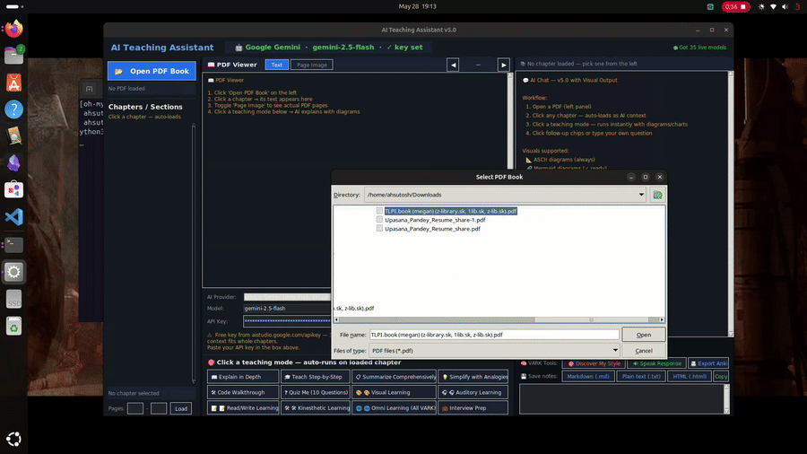
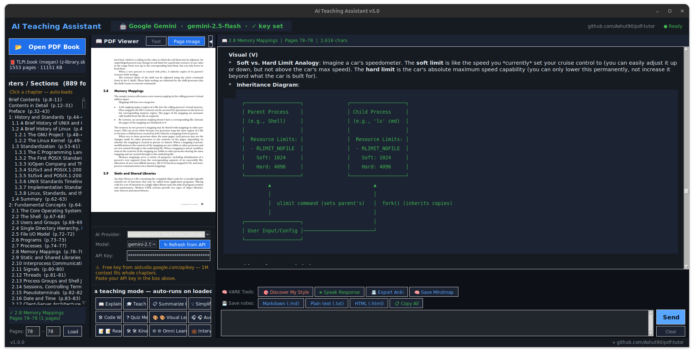
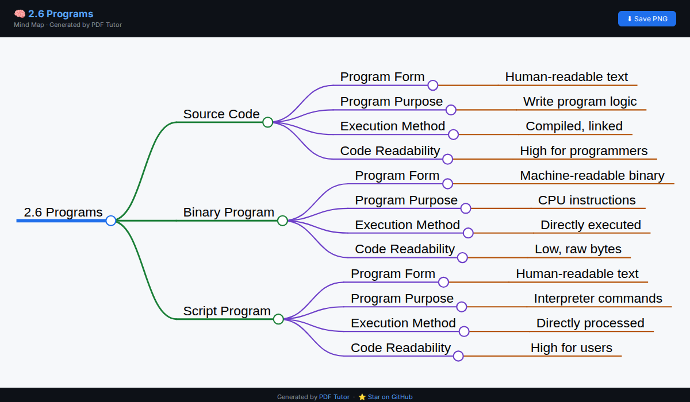

# PDF Tutor

[](https://www.python.org/)
[](LICENSE)
[](https://github.com/Ashut90/pdf-tutor/actions/workflows/ci.yml)
[](#installation)
[](CONTRIBUTING.md)



---

I read a lot of technical PDFs — textbooks, research papers, course materials. The problem is that reading them passively doesn't really work for me. I'd finish a chapter and retain almost nothing.

I tried highlighting, re-reading, watching videos on the same topic — still slow. What actually helped was having someone *explain* it to me in different ways. A diagram here, a quick quiz there, hearing it out loud.

So I built this. You drop a PDF in, pick a chapter, and it explains it to you — using whichever style actually works for your brain. Diagrams if you're visual, audio if you're auditory, structured notes, or hands-on commands if you learn by doing. It can also run completely offline if you don't want your study material leaving your machine.

---

## Screenshots

| Main window | Exported mind map |
|:-----------:|:-----------------:|
|  |  |

---

## How it works

The app reads the table of contents from your PDF and lets you pick a chapter. It sends that chapter's text to whichever AI you've set up and asks it to explain things in the style you want.

The learning modes are based on [VARK](https://vark-learn.com/) — Visual, Auditory, Read/Write, Kinesthetic. There's also a quiz that figures out which style fits you, and an Omni mode that does all four at once.

**Visual** — mind maps, flowcharts, comparison tables
**Auditory** — conversational explanation + reads it out loud (TTS)
**Read/Write** — structured notes, definitions, writing prompts
**Kinesthetic** — terminal commands and code experiments you can actually run

You can export notes as Markdown or HTML, generate Anki flashcards, or save interactive mindmaps as HTML files.

---

## AI providers

It supports four providers — use whichever you already have access to:

| Provider | Cost | Where it runs |
|----------|------|---------------|
| **Ollama** | Free | Your machine (fully offline) |
| **Google Gemini** | Free tier | Cloud |
| **Groq** | Free tier | Cloud |
| **OpenRouter** | Free tier | Cloud |

I mostly use Gemini because its 1M token context window handles entire chapters without truncation. Ollama is great when I'm on a plane or don't want data leaving my machine.

---

## Installation

```bash
git clone https://github.com/Ashut90/pdf-tutor.git
cd pdf-tutor
pip install -r requirements.txt
python -m pdf_tutor
```

That's enough to get started. Two optional system packages unlock extra features:

```bash
sudo apt install graphviz   # diagram fallback when offline
sudo apt install espeak-ng  # offline TTS (otherwise falls back to gTTS)
```

On macOS, replace `apt` with `brew`. On Windows, `graphviz` has an installer at [graphviz.org/download](https://graphviz.org/download/) and TTS uses SAPI5 built-in.

---

## Setting up a provider

**Ollama (offline):**
```bash
# Install from https://ollama.com, then:
ollama pull qwen2.5-coder:7b
ollama serve
```
Select Ollama in the app — no key needed.

**Gemini / Groq / OpenRouter:**
Get a free key from [aistudio.google.com/apikey](https://aistudio.google.com/apikey), [console.groq.com](https://console.groq.com), or [openrouter.ai](https://openrouter.ai), paste it into the app, done.

---

## Architecture



The UI loads a chapter via `core/pdf.py`, sends the text with a mode-specific prompt (`learning/modes.py`) to the selected provider (`ai/client.py`), and renders any diagrams or charts the AI produces (`rendering/visuals.py`).

---

## Project structure

```
pdf-tutor/
├── pdf_tutor/
│   ├── __main__.py          # entry point
│   ├── config.py            # theme, fonts, providers
│   ├── core/pdf.py          # TOC extraction, text/page rendering
│   ├── ai/client.py         # unified client for all 4 providers
│   ├── rendering/visuals.py # diagram / chart rendering
│   ├── learning/modes.py    # VARK prompts and teaching modes
│   └── ui/app.py            # Tkinter GUI
├── tests/
├── requirements.txt
└── pyproject.toml
```

---

## Running tests

```bash
pip install pytest
pytest -v
```

---

## What's next

Things I want to add but haven't gotten to yet:

- Conversation history that persists across sessions
- Multi-PDF library with search
- EPUB and DjVu support
- Configurable prompt templates per subject

If any of these interest you, feel free to open a PR.

---

## Contributing

Open an issue first if it's a bigger change — happy to discuss direction before you spend time on it. For small fixes, just open a PR directly.

---

## License

MIT — see [LICENSE](LICENSE).

---

## Credits

- [PyMuPDF](https://pymupdf.readthedocs.io/) for PDF parsing
- [Ollama](https://ollama.com), [Groq](https://groq.com), [Google AI Studio](https://aistudio.google.com), [OpenRouter](https://openrouter.ai) for model access
- [VARK model](https://vark-learn.com/) by Neil Fleming
